<h3> Hello </h3>

My name is Abdul Malik Ikhsan. I am a PHP Developer and System Engineer. I live in Bandung Barat, Indonesia.

:pencil: I like [blogging about tech](https://samsonasik.wordpress.com/).

:building_construction: I like to [contribute to OSS projects](https://github.com/samsonasik?tab=repositories) and [publish OSS packages](https://packagist.org/users/samsonasik/packages/) as well.

